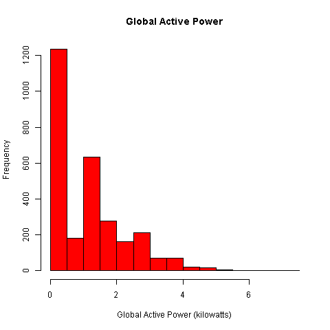
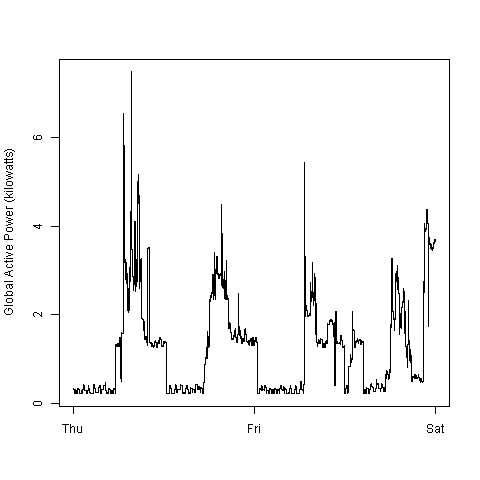
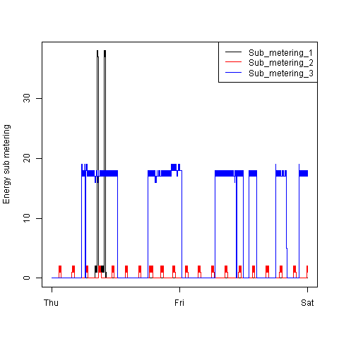
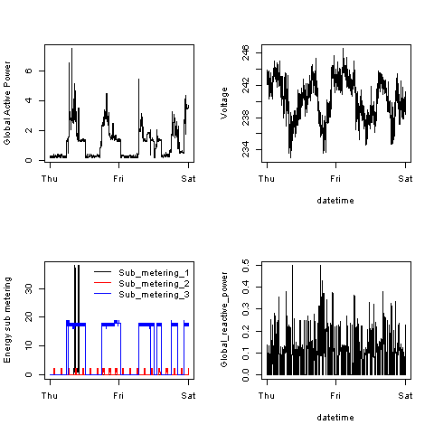

# Exploratory Data Analysis - Project 1

This repository containes the files necessary to complete the first project for the "Exploratory Data Analysis"
Coursera course.

This project consists of the following:

1. [Project instruction page] (ProjectInstructions.md)
2. "Instruction List" see below
3. [Code Book] (CodeBook.md)
4. The R Scripts for implementing the project
<ul>
<li>[plot1.R] (plot1.R)</li>
<li>[plot2.R] (plot2.R)</li>
<li>[plot3.R] (plot3.R)</li>
<li>[plot4.R] (plot4.R)</li>
</ul>
5. Output image files generated for the project
<ul>
<li>[plot1.R] (plot1.R)</li>
<li>[plot2.png] (plot2.png)</li>
<li>[plot3.png] (plot3.png)</li>
<li>[plot4.png] (plot4.png)</li>
</ul>
## Instruction List

* The R scripts only load the required data for the assignment i.e. data for 2007-02-01 and
2007-02-02. This saves computing resources as the full data set is quite large

* An additional event_time vector is created when required, to store the datetime of the recorded event

### Input Data

Before executing the scripts 
<ul class="task-list">
<li>
Download and extract the <a href="https://d396qusza40orc.cloudfront.net/exdata%2Fdata%2Fhousehold_power_consumption.zip">Electric power consumption</a> [20Mb] data set 
</li>
<li>
In R set the working directory to the location where you extracted this file using the <b>setwd</b> command
</li>
</ul>

### Executing the scripts

Each script creates an image file with the file name of the R Script and the PNG extension in your R working directory.

### What the scripts do

1. Loads the subset of data for 1st and 2nd Feb 2007 into a data table.
2. Plots the chart to a PNG file

### Output

The following four plots are generated by the R scripts developed for this project

#### Plot 1

 

#### Plot 2

#### Plot 3

#### Plot 4

============================================================================

The original four plots provided by the project instruction are shown below. 

#### Plot 1

 

#### Plot 2

 

#### Plot 3

 

#### Plot 4

 

## Version information

This script was developed & tested with R version 3.1.2 on the 32 bit Windows platform [windows 7] using RStudio version 0.98.1091

The "data.table" library was used to manipulate table data more efficiently in memory (version 1.9.4)